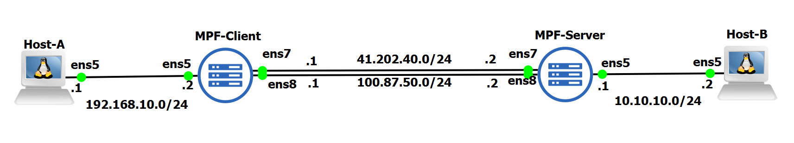

# Multipath-Gateway-Function
Multipath Gateway Function for a Hybrid 5G and WiFi Network




# Bi-Directional Communication with NAT and MPTCP

## Overview
This project implements a bi-directional communication architecture involving an **MPF Gateway**, **Host A** (internal), **Host B** (external), and an **MPF server**. The architecture employs **Network Address Translation (NAT)** and **Multipath TCP (MPTCP)** for efficient traffic routing between internal and external networks. The **MPF Gateway** captures and processes traffic using **PCAP, NAT, and MPTCP** in the **forward direction** (from Host A to Host B), while the **MPF server** captures and processes traffic using **PCAP, NAT, and MPTCP** in the **reverse direction** (from Host B to Host A).

### Key Features:
- **Bi-directional communication** between Host A and Host B through the MPF server.
- **NAT, PCAP, and MPTCP** implemented on both the MPF Gateway (forward direction) and the MPF server (reverse direction).
- **Multipath TCP (MPTCP)** for multi-path communication over multiple network interfaces.
- **PCAP library** used on both the MPF Gateway and the MPF server for traffic capture.

## Architecture

### 1. Host A (Internal Network)
- **Role**: Host A is part of the internal network and communicates with the MPF server through the MPF Gateway.
- **Communication**: Host A sends traffic through the MPF Gateway, which captures the traffic using **PCAP**, performs **NAT**, and forwards the traffic to the MPF server using **MPTCP**. Host A receives responses from Host B via the MPF server, which forwards the traffic using the reverse direction process.
- **Bi-Directional Traffic**: Host A can send and receive traffic to/from Host B via the MPF server. The MPF Gateway handles the NAT, PCAP, and MPTCP for outgoing traffic, and the MPF server handles the same for incoming traffic.

### 2. MPF Gateway (Forward Direction: Host A to Host B)
- **Role**: The **MPF Gateway** is responsible for capturing traffic from Host A using **PCAP**, performing **NAT**, and forwarding it to the MPF server using **MPTCP**. It implements these functions in the **forward direction** (from Host A to Host B).
- **Key Responsibilities**:
  - **PCAP**: Captures traffic from **Host A**.
  - **NAT**: Translates Host A's internal IP address to the gateway's external IP.
  - **MPTCP**: Forwards traffic to the MPF server using multiple paths for improved reliability and performance.
- **Bi-Directional Traffic Handling (Forward)**:
  - **Outbound (Host A to Host B)**: The MPF Gateway captures and processes traffic from Host A using PCAP, NAT, and MPTCP, and forwards it to the MPF server.

### 3. MPF Server (Reverse Direction: Host B to Host A)
- **Role**: The **MPF server** is responsible for capturing traffic from Host B using **PCAP**, performing **NAT**, and forwarding it to the MPF Gateway using **MPTCP**. It implements these functions in the **reverse direction** (from Host B to Host A).
- **Key Responsibilities**:
  - **PCAP**: Captures traffic from **Host B**.
  - **NAT**: Translates Host B's IP to the MPF server's IP before forwarding the traffic.
  - **MPTCP**: Forwards the captured and processed traffic to the MPF Gateway over multiple paths.
- **Bi-Directional Traffic Handling (Reverse)**:
  - **Inbound (Host B to Host A)**: The MPF server captures and processes traffic from Host B using PCAP, NAT, and MPTCP, and forwards it to the MPF Gateway, which then sends it to Host A.

### 4. Host B (External Network)
- **Role**: Host B is part of the external network and communicates with the MPF server. Host B sends traffic to the MPF server, where it is captured using **PCAP**, processed using **NAT**, and forwarded to the MPF Gateway using **MPTCP**.
- **Communication**: Host B communicates directly with the MPF server. The MPF server captures and processes the traffic before sending it to Host A via the MPF Gateway.

## Communication Flow

### Outbound (Host A to Host B):
1. **Host A** sends traffic destined for **Host B**.
2. **MPF Gateway** captures the traffic using **PCAP**, performs **NAT**, and translates the internal IP of Host A to the gateway’s external IP.
3. **MPF Gateway** forwards the traffic to the **MPF Server** using **MPTCP** over multiple network interfaces.
4. **MPF Server** receives the traffic and forwards it to **Host B**, which is directly connected to the server.
5. **Host B** receives the traffic from the MPF server.

### Inbound (Host B to Host A):
1. **Host B** sends traffic to **Host A** via the **MPF Server**.
2. **MPF Server** captures the traffic using the **PCAP library**.
3. **MPF Server** performs **NAT** and translates Host B’s IP to its own external IP.
4. **MPF Server** forwards the captured traffic to the **MPF Gateway** using **MPTCP**.
5. **MPF Gateway** performs reverse **NAT** and forwards the traffic to **Host A**, completing the bi-directional communication.

## Technologies Used
- **Go**: The primary language used to implement NAT, MPTCP, and PCAP-based packet capturing.
- **pcap/gopacket**: Used for **capturing packets** at both the MPF Gateway (forward direction) and the MPF server (reverse direction).
- **Multipath TCP (MPTCP)**: Allows both the MPF Gateway and the MPF server to communicate over multiple network paths for improved reliability and bandwidth aggregation.
- **Network Address Translation (NAT)**: Implemented at both the MPF Gateway (forward direction) and the MPF server (reverse direction) to allow communication between Host A and Host B, translating IP addresses for correct routing.

## Setup & Usage
1. **Clone the Repository**:
   ```bash
   git clone https://github.com/yourusername/yourrepository.git
   cd yourrepository
   ```

2. **Install Dependencies**:
   Ensure you have `Go` installed. Install any necessary Go packages, such as `gopacket` and `pcap`:
   ```bash
   go get github.com/google/gopacket
   go get github.com/google/gopacket/pcap
   ```

3. **Configure Network Interfaces**:
   - Ensure the network interfaces (e.g., `ens7`, `ens8`) are configured correctly for MPTCP support on both the MPF Gateway and the MPF server.
   - Enable MPTCP in your Linux kernel (if not already enabled):
     ```bash
     sudo sysctl -w net.mptcp.enabled=1
     ```

4. **Run the Application**:
   You can run the application on each node (Host A, MPF Gateway, MPF Server, and Host B) as required:
   ```bash
   go run main.go
   ```

## License
This project is licensed under the MIT License - see the [LICENSE](LICENSE) file for details.


